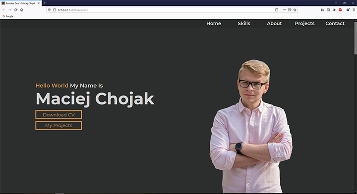

# My Portfolio
> Project of my porfolio website. There you can meet me, download my CV and check what i know.

## Table of contents
* [General info](#general-info)
* [Screenshots](#screenshots)
* [Technologies](#technologies)
* [Setup](#setup)
* [Status](#status)
* [Contact](#contact)

## General info
It is my first project, which I made as a part of CodersCamp Course. With this website I wanted to learn HTML and CSS. Mainly, I used flexbox and grid to make this website. 

## Screenshots
* Desktop Version

* Mobile Version

## Technologies
* HTML5
* CSS3

## Setup
If you want to see my page, you can do it on your local computer(download this repositorie and open index.html with any browser) or just visit https://mchojak97.github.io/myportfolio-website/

## Status
Project is _finished_.

## Contact
Created by [@Maciej Chojak](https://mchojak97.github.io/myportfolio-website/) - feel free to contact me!
